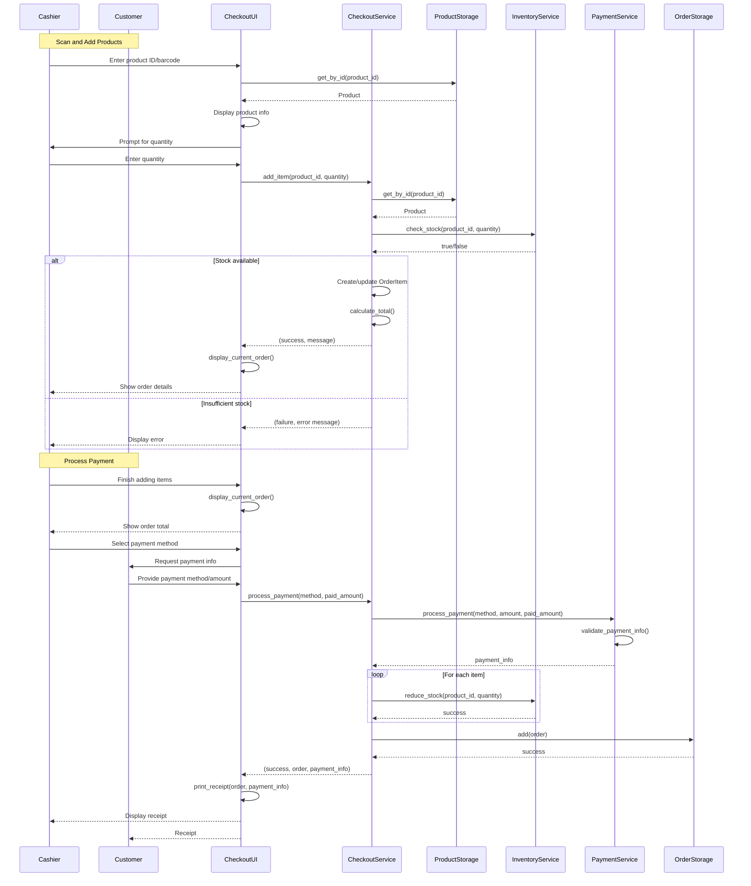
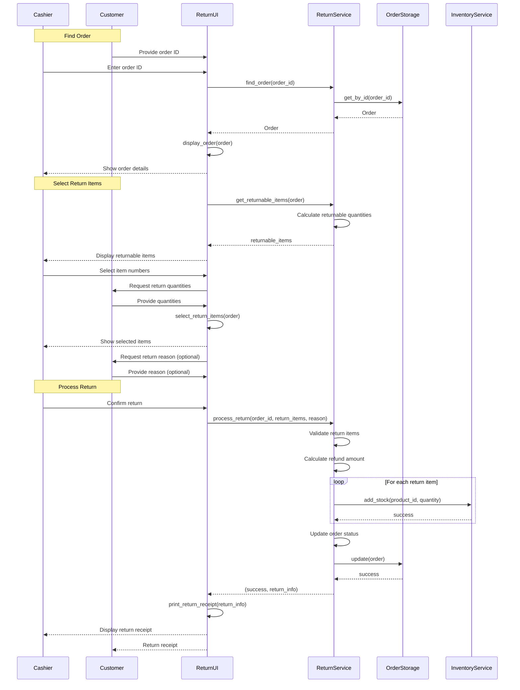

# POS System - System Sequence Diagrams

## Sequence Diagram 1: Checkout Process

## Sequence Diagram 2: Return Process

## Diagram Elements

- **Actors**: Cashier, Customer
- **System Objects**: UI components, Services, Storage components
- **Messages**: Method calls and responses
- **Alt Blocks**: Alternative flows (e.g., stock available vs. insufficient)
- **Loop Blocks**: Iterative operations (e.g., processing multiple items)

