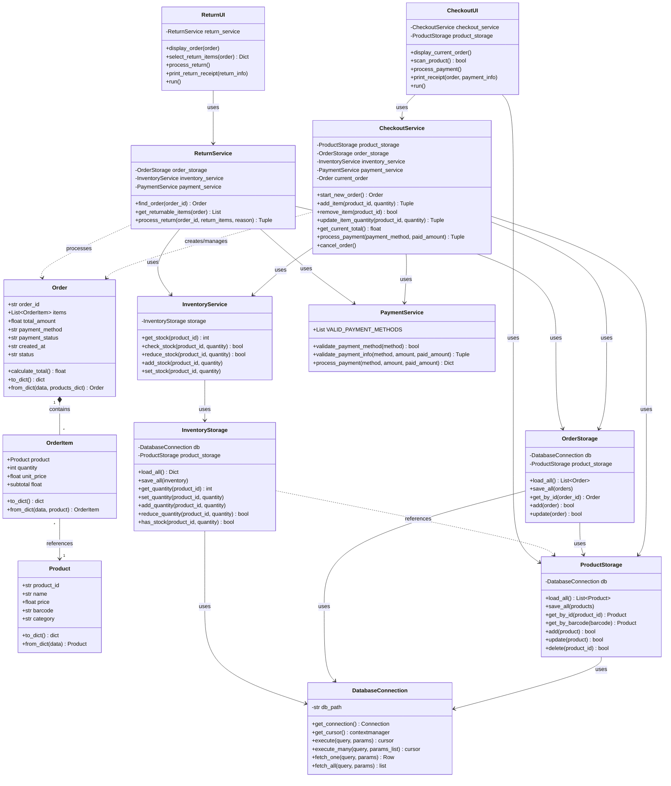

# POS System - UML Class Diagram (Mermaid)

## Legend

- **Composition** (`*--`): Order contains OrderItems
- **Association** (`-->`): OrderItem references Product
- **Dependency** (`-->` or `..>`): Service uses Storage, UI uses Service

## Layer Description

1. **Models**: Core data structures (Product, Order, OrderItem)
2. **Services**: Business logic (Checkout, Return, Inventory, Payment)
3. **Storage**: Data persistence (JSON file storage)
4. **UI**: User interface (CheckoutUI, ReturnUI)

