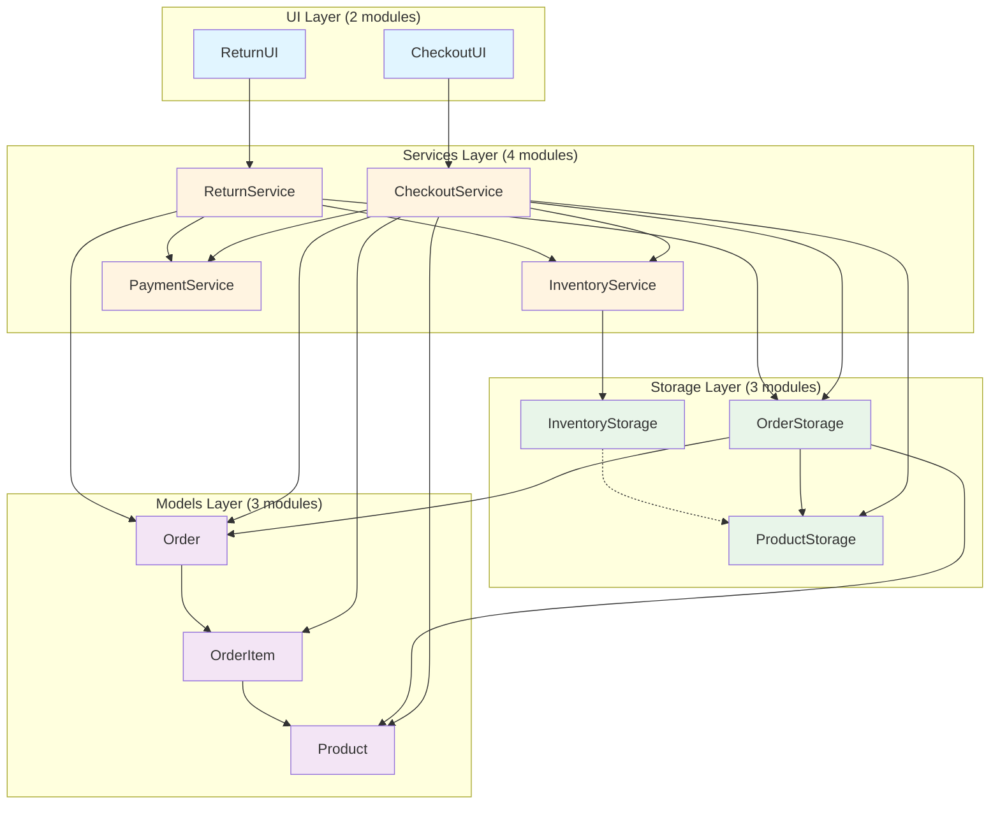

# POS System - UML Package Diagram

This diagram shows the layered architecture of the POS System with packages organized by layers.

## Layer Structure

### 1. UI Layer (2 modules)
- **CheckoutUI**: User interface for checkout process
- **ReturnUI**: User interface for return process

### 2. Services Layer (4 modules)
- **CheckoutService**: Handles checkout business logic
- **ReturnService**: Handles return business logic
- **InventoryService**: Manages inventory operations
- **PaymentService**: Validates and processes payments

### 3. Storage Layer (3 modules)
- **ProductStorage**: Persists product data (JSON)
- **OrderStorage**: Persists order data (JSON)
- **InventoryStorage**: Persists inventory data (JSON)

### 4. Models Layer (3 modules)
- **Product**: Product data model
- **Order**: Order data model
- **OrderItem**: Order item data model

## Dependency Rules

1. **UI Layer** depends only on **Services Layer**
2. **Services Layer** depends on **Storage Layer** and **Models Layer**
3. **Storage Layer** depends on **Models Layer**
4. **Models Layer** has no dependencies (base layer)

## Architecture Pattern

This follows a **Layered Architecture** pattern:
- Clear separation of concerns
- Each layer has a specific responsibility
- Dependencies flow downward (top layers depend on bottom layers)
- Lower layers are independent of higher layers

