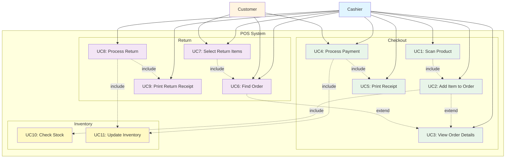

# POS System - Use Case Diagram

## Use Cases

### Checkout Use Cases
- **UC1: Scan Product** - Cashier scans or enters product ID/barcode
- **UC2: Add Item to Order** - System adds item to current order
- **UC3: View Order Details** - Display current order with running total
- **UC4: Process Payment** - Customer provides payment, system processes it
- **UC5: Print Receipt** - System generates and prints receipt

### Return Use Cases
- **UC6: Find Order** - Customer provides order ID, system finds order
- **UC7: Select Return Items** - Select items and quantities to return
- **UC8: Process Return** - System processes return and updates inventory
- **UC9: Print Return Receipt** - System generates return receipt

### Inventory Use Cases
- **UC10: Check Stock** - Verify product availability
- **UC11: Update Inventory** - Update stock after sale or return

